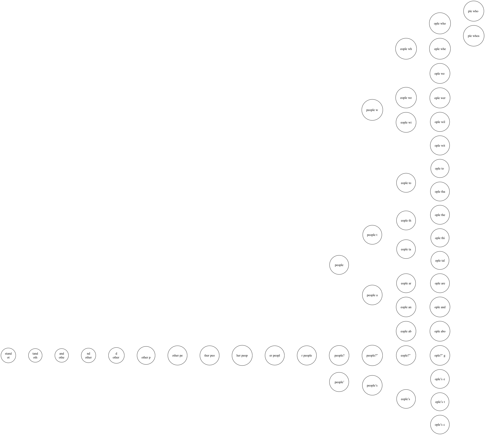

# Markov Chains

This repository contains a simple implementation of a Markov chain and it is trained on "A Picture of Dorian Gray" by Oscar Wilde.

## Theory

A Markov chain is a stochastic model describing a sequence of possible events in which the probability of each event depends only on the state attained in the previous event. In this case, the Markov chain is trained on the text of "A Picture of Dorian Gray" by Oscar Wilde. The chain is then used to generate new text based on the transition probabilities that were learned from the training text.

### Mathemtical Definition

Given a sequence of random variables $X_1, X_2, X_3, \ldots$ which exist in the state space $X_i$ the process is a Markov chain if the probability of moving to the next state depends only on the present state and not on the previous states.

This means that we have:

$$ P(X_{n+1} = x \mid X_1 = x_1, \ldots, X_n = x_n) = P(X_{n+1} = x \mid X_n = x_n) $$

## Implementation

The implementation of the Markov chain is done in the `main.py` file. The code is structured as follows:

1. The text is read from the file and preprocessed.
2. The Markov chain is trained on the text.
3. The chain is used to generate new text.
4. The chain is visualised with a graph of transition probabilities.

### Training

The training of the Markov chain is done by iterating over the text and counting the number of times each character follows a specific sequence of characters. The length of the preceding sequence is defined by the `order` parameter.

### Generation

The generation of new text is done by starting with a random sequence of characters and then using the Markov chain to predict the next character. The next character is chosen based on the transition probabilities learned during training. The training doesn't calculate probabilities, instead it stores a count for each transition. Therefore the probabilities are calculated by normalising the counts.

This character is then added to the sequence and the process is repeated until the desired length of the text is reached.

#### Temperature

To control the randomness of the generated text, a temperature parameter can be used. The temperature controls the randomness of the next character by scaling the probabilities.

The temperature scales the counts of the transitions by raising them to the power of `1 / temperature`. This means that a higher temperature will result in a more uniform distribution of the probabilities, while a lower temperature will result in a more deterministic distribution.


## Visualisation

The visualisation of the Markov chain is done by creating a graph of the transition probabilities. The graph is created using the `graphviz` library.

The graph is created by collecting the top 3 most probable transitions for each state and then creating a directed graph with the probabilities as the weights of the edges.



## Setup

The requierements for this code can be installed by running the following command:

```bash
pip install -r requirements.txt
```

To visualise the Markov chain, you need to install the following dependencies:

```bash
brew install graphviz
```

