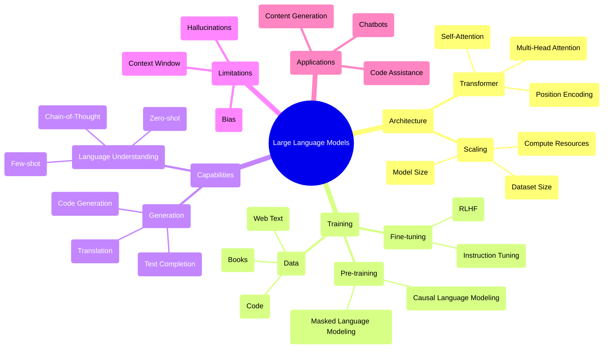

```mermaid
mindmap
  root((Large Language Models))
    (Architecture)
      (Transformer)
        (Self-Attention)
        (Multi-Head Attention)
        (Position Encoding)
      (Scaling)
        (Model Size)
        (Dataset Size)
        (Compute Resources)
    (Training)
      (Pre-training)
        (Masked Language Modeling)
        (Causal Language Modeling)
      (Fine-tuning)
        (RLHF)
        (Instruction Tuning)
      (Data)
        (Web Text)
        (Books)
        (Code)
    (Capabilities)
      (Language Understanding)
        (Zero-shot)
        (Few-shot)
        (Chain-of-Thought)
      (Generation)
        (Text Completion)
        (Translation)
        (Code Generation)
    (Limitations)
      (Hallucinations)
      (Bias)
      (Context Window)
    (Applications)
      (Chatbots)
      (Code Assistance)
      (Content Generation)
```